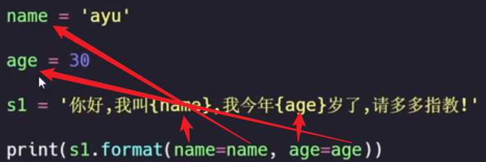

###### 字符串格式化

1. format

    通过大括号 + 字符串的 format 方法, 来在字符串中引用变量

    ```python
    name = 'super'
    age  = 301
    s1 = 'hello, my name is {name_}, i am {age_} years old!'
    print(s1.format(name_ = name, age_ = age))   #注意此处的对应关系, 教程里面可能容易混淆, 见下图
    ```



2. f-string

```python
s2 = f'my name is {name}, i am {age} years old!'
print(s2)

```

3. 字符串常用操作