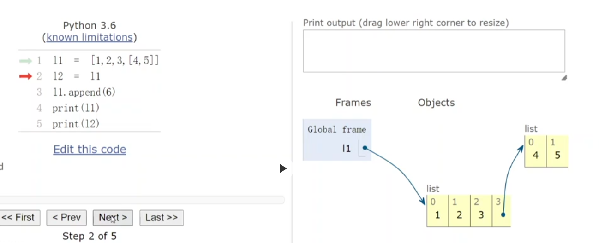
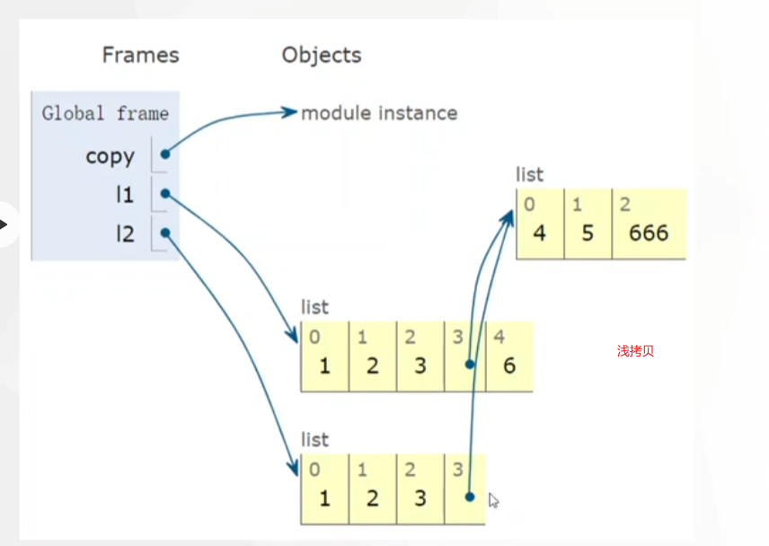
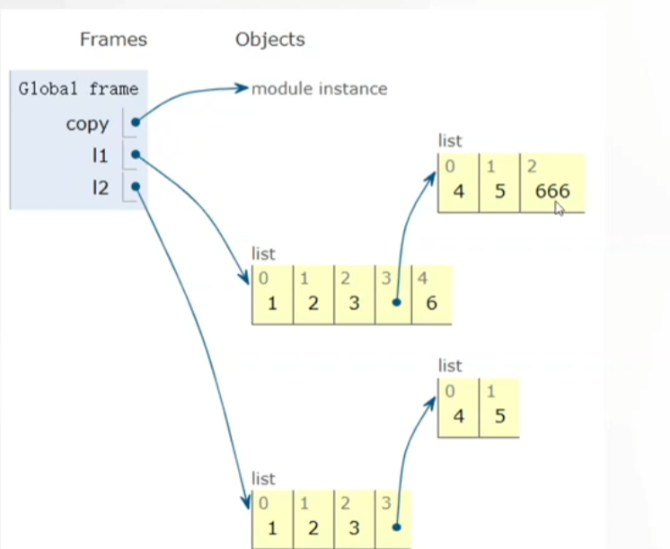

python 中的变量是引用型变量, 变量存放的内存地址, 这个内存地址指向的内存存放了真正的值.

存在的问题

解决方法: 浅拷贝和深拷贝

- 浅拷贝 copy.copy(obj)
    - 在内存中开辟新的空间存放被拷贝的可变对象, 但是如果被拷贝的可变对象还指向了其它可变对象, 其它可变对象不会跟着拷贝.
- 深拷贝 copy.deepcopy(obj)
    - 不仅会拷贝存放的可变对象, 连对象中存放的可变对象也会一起被拷贝

