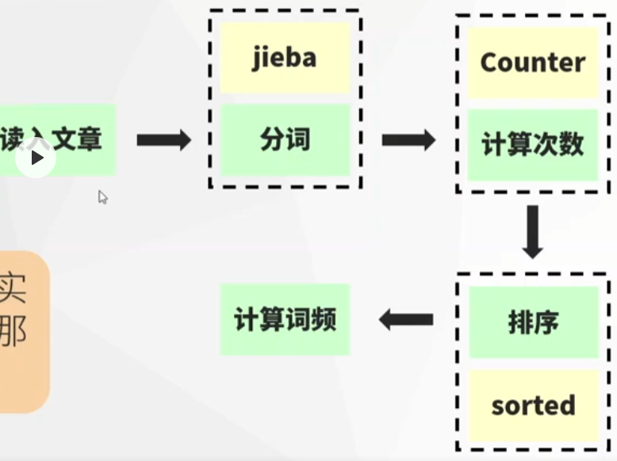

完整代码在 ./codes/016/016_wordsFreq.py


词频 = 某个词出现的次数 / 文章总词数

思路: 

1. 读入文章
2. 通过 jieba 将文章进行分词
3. 对每个词进行统计, 统计出现的次数
4. 按照出现次数进行排序, 取前几位的词计算词频




###### 读入文章

```python
# 读取 ./news.txt 这个文件
with open("./news.txt", 'r', encoding="utf8") as txt_file:
    txt = txt_file.read()

# 对字符串进行预处理, 剔除换行符, 和制表符
txt = txt.replace("\n", '').replace('\u3000', '')
```


###### 通过 jieba 进行分词

```python
import jieba

words = jieba.cut(txt)  #PS: words 是一个生成器

#定义需要过滤的垃圾词汇
spam_words = ['，', '。', '的', '了']

#通过生成器转换成需要的list
words_list = []
for word in words:
    if word and word not in spam_words:
        words_list.append(word)
#PS 此时words是一个空的生成器,再取就生成不了内容

```


###### 对每个词进行次数的统计, 排序

```python
from collections import Counter

count = Counter(words_list)

res = sorted(count.items(), key=lambda x: x[1], reverse=True)

```


###### 处理出我们需要的结果

```python
top_5_word = res[:5]
for item in top_5_word:
    word_freq = item[1] / len(words_list)    #词频计算公式    词频 = 某个词出现的次数 / 文章总词数
    print(f'{item[0]} 出现了 {item[1]} 次, 词频是 {word_freq}')
```

