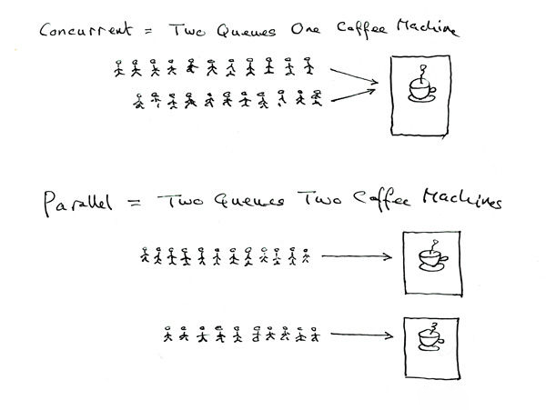

一个程序至少有一个进程, 一个进程至少一个线程, 一般情况下是多线程状态

互斥锁是指一个线程使用某一内存空间时会获得的一把“锁”，它会使用锁将这个内存空间锁起来，其他线程只有等当前线程使用完毕并将锁释放，才能使用该内存空间中的资源。任何线程获得释放后的锁，就有了使用权利，其他线程依旧要排队等待。

信号量用来指定某一内存空间通常可以被多少个线程使用。例如，当信号量为4时，内存空间中最多能同时存在4个线程，某个线程操作完内存空间中的资源后，信号量会自增1，从而允许其他线程进入该内存空间。

###### 同步vs异步

同步==有序执行, 不是同时执行

异步==独立执行, 互相之间不需要通信等待


##### 并发 vs 并行



并发, 程序交替执行

并行, 程序同一时刻运行


### threading库

python有3种使用线程的方式: thread, threading, ThreadPoolExecutor

- thread,   已被废弃更名为_thread
- threading  基于_thread, 比较常用
- ThreadPoolExecutor 在threading基础上进一步封装, 使用简单, 但是无法对线程进行精细控制

Threading 有两种方式创建线程

- 方法1: 创建 threading.Thread 实例, 将需要被线程执行的函数传入该实例

    - ```python
        import time, threading
        
        def longtime(s): time.sleep(s)    #需要通过线程执行的函数, sleep s 秒
        
        if __name__ == '__main__':
            #实例化一个线程
            thread = threading.Thread(target=longtime, args=[10])   
            # target 为 函数名, args 要传入的所有参数
            
            print('Start', time.perf_counter())
            
            # start() 启动线程, 注意, 如果同一个线程对象被多次调用, 会报错
            thread.start()     
            # join(timeout=None) 将主线程挂起, 知道子线程运行结束, timeout为挂起的时间, None表示等到子线程结束.
            thread.join()
            
            
            print('Done', time.perf_counter())
        ```


- 方法2: 创建一个类, 继承于 threading.Thread, 重写其 run() 方法并可以加入额外处理逻辑

    - ```python
        import time, threading
        
        class MyThread(threading.Thread):
            def __init__(self, func, args, thread_name=''):
                #首先要调用父类的构造函数
                super(MyThread, self).__init__()
                
                self.func = func
                self.args = args
                self.thread_name = thread_name
                
            #自定义线程执行的具体逻辑
            def run(self):
                #加入一些额外的逻辑
                print('额外逻辑')
                print(self.func.__name__ + 'is running!')
                self.func(*self.args)
         
        def longtime(s): time.sleep(s)
        
        if __name__ == '__main__':
            #实例化线程
            thread = MyThread(longtime, (10, ), longtime.__name__)
            print('start ', time.perf_counter())
            thread.start()
            thread.join()
            print('end ', time.perf_counter())
        ```

    - 两个线程并发?

        - ```python
            t1 = MyThread(...)
            t2 = MyThread(...)
            t1.start()
            t1.join()
            t2.start()
            t2.join()
            ```

    - 并行?

        - ```python
            t1.start()
            t2.start()
            t1.join()
            t2.join()
            ```

        不知道我理解的对不对?????????????


## threading库提供的同步机制

### 线程锁

> 多个线程使用同一个资源时, 有可能发生冲突, 产生意料之外的情况

**解决这个问题, 最简单的方式是 Lock 机制**

```python
import time, threading

class MyThread(threading.Thread):
    def __init__(self, input, output, lock):
        super(MyThread, self).__init__()
        self.input = input
        self.output = output
        self.lock = lock # 传入的 lock 对象
        
    def run(self):
        self.lock.acquire()        # 获得lock对象=lock状态变为locked, 阻塞其它线程获取 lock对象
        for line in self.input.readlines():
            time.sleep(1)     # 模拟耗时操作
            self.output.write(line)
        self.lock.release()        # 释放 lock 对象, 其它线程可以获取 lock 对象
        print('Thread Done')
        
def main():
    #创建lock对象
    lock = threading.Lock()
    
    txt1 = open('1.txt', 'r')
    txt2 = open('2.txt', 'r')
    txt3 = open('3.txt', 'a')
    t1 = MyThread(txt1, txt3, lock)
    t2 = MyThread(txt2, txt3, lock)
    t1.start()
    t2.start()
    print('Done')

main()
```

**利用 with 关键字简化锁的获取与释放过程**

```python
def run(self):
        with self.lock: # 锁会自动获取与释放
            for line in self.input.readlines():
                time.sleep(1) # 模拟耗时操作
                self.output.write(line)
        print('Thread Done')
```

**PS!  线程在locked状态如果再次调用 acquire() 会产生死锁**

### 可重入锁

可以使得同一线程下, 多次调用 acquire() 方法

与普通锁不同，可重入锁底层使用递归实现，同一个线程每一次调用acquire()方法获取锁，对应的计数器会加1，而调用release()方法释放锁时，计数器会减1。

**可重入锁要求调用acquire()方法的次数与调用release()方法的次数相同。**

与普通锁唯一的区别是 lock 对象不一样, 同样可以通过with简化

```python
import time
import threading

class MyThread(threading.Thread):
    def __init__(self, input, output, lock):
        super(MyThread, self).__init__()
        self.input = input
        self.output = output
        self.lock = lock # 传入的lock对象

    def run(self):
        self.lock.acquire() # 获得lock对象，lock状态变为locked，并且阻塞其他线程获取lock对象
        self.lock.acquire() # 可重入锁，可以多次使用acquire()
        for line in self.input.readlines():
            time.sleep(1) # 模拟耗时操作
            self.output.write(line)
        self.lock.release() # 释放lock对象
        self.lock.release()
        
        #with self.lock:
        #    with self.lock:
        #        for line in self.input.readlines():
         #       time.sleep(1) # 模拟耗时操作
         #       self.output.write(line)
        
        
        print('Thread Done')

def main():
    lock = threading.RLock() # 创建lock对象
    txt1 = open('1.txt', 'r')
    txt2 = open('2.txt', 'r')
    txt3 = open('3.txt', 'a')
    t1 = MyThread(txt1, txt3, lock)
    t2 = MyThread(txt2, txt3, lock)
    t1.start()
    t2.start()
    print('Done')
```


### ThreadLocal   线程级别的局部变量

线程通过这种方式, 拥有独立的私有数据, 只对当前线程可见, 对其他线程不可见.

> 为什么不通过局部变量来实现?
>
> ​		使用局部变量确实可以实现这样的效果，但线程逻辑比较复杂，有较多函数调用时，局部变量的形式并不友好，局部变量作为函数参数，相互传递起来会让代码难以维护。

```python
import threading

local_value = threading.local()    #全局ThreadLocal变量

def get_name():
    name = local_value.name    #获取当前线程中的内容
    print(f'hello {name}')
    
def my_thread(name):
    local_value.name = name    #改变当前线程中的变量
    get_name()
    
t1 = threading.Thread(target=my_thread, args=['oneone'], name='t1')
t2 = threading.Thread(target=my_thread, args=['twotwo'], name='t2')
t1.start()
t2.start()

```

**全局变量local_v就是ThreadLocal类型的对象，每个线程都可以操作local_v变量的属性且互不影响，其中的数据只对当前线程可见。**


### ThreadPoolExecutor

`concurrent.futures` 模块提供了 `ThreadPoolExecutor` 线程池    和       `ProcessPoolExecutor` 进程池 两个类

相比 threading 等模块，该模块通过 submit 返回的是一个 future 对象，它是一个未来可期的对象，通过它，主线程(或进程)中可以获取某一个线程(进程)执行的状态或者某一个任务执行的状态及返回值。

```python
import time, random
from concurrent.futures import ThreadPoolExecutor, as_completed

def spider(url):
    '''爬虫方法'''
    time.sleep(random.randint(1,5))
    print(f'crawler task {url} finished')
    return url


#创建一个最大容量为5的线程池
with ThreadPoolExecutor(max_workers=5) as executor:
    urls = ['https://abc.com', 'https://efg.com', 'https://sdf.com', 'https://sdfs.com', 'https://abc.com', 'https://efg.com',  'https://hij.com',  'https://klm.com',  'https://nop.com',  'https://rsz.com']
    all_task = []
    for url in urls:
        #将任务提交到线程池中执行
        task = executor.submit(spider, url)

        #记录任务列表
        all_task.append(task)
        
    #阻塞, 获得任务完成后的返回值
    for future in as_completed(all_task):
        result = future.result()
        print(f'result: {result}')

    print('main finish')
```

as_completed() 是一个生成器, 没有任务完成的时候会一直阻塞(也可以设置timeout)

一旦里面有任务完成了, 那么会yield 这个任务出来, 在上面的代码中, 就会执行 for 语句内部的逻辑, 执行完了继续阻塞, 直下一个任务yield出来

先完成的任务会先返回给主线程


#### wait()方法

如果希望所有的任务完成后, 再回到主线程, 那么就要用到wait方法

```python
import time
import random
from concurrent.futures import ThreadPoolExecutor, as_completed, wait, ALL_COMPLETED

def spider(url):
    """爬虫方法"""
    time.sleep(random.randint(1, 5))
    print(f'crawl task {url} finished')
    return url

#  创建一个最大容纳数量为5的线程池
with ThreadPoolExecutor(max_workers=5) as executor:
    urls = ['https://abc.com', 'https://efg.com',  'https://hij.com',  'https://klm.com',  'https://nop.com',  'https://rsz.com']
    all_task = []
    for url in urls:
        task = executor.submit(spider, url)
        all_task.append(task)
    # 等待所有任务完成后再返回主线程
    wait(all_task, return_when=ALL_COMPLETED)
    for future in as_completed(all_task):
        result = future.result()
        print(f'result: {result}')
    print('main finish')
```


### ThreadPoolExecutor异常捕获

第一种方法是 主动抛出异常

```python
import time
from concurrent.futures import ThreadPoolExecutor, as_completed

def error(t):
    """没有返回值"""
    time.sleep(t)
    # 主动抛出异常
    raise Exception('This is Error')
    print(f'sleep {t}s')

with ThreadPoolExecutor(max_workers=5) as executor:
    all_task = []
    for i in range(5):
        task = executor.submit(error, 2)
        all_task.append(task)
    for future in as_completed(all_task):
        try:
            data = future.result()
        except Exception as e: # 异常处理
            print(f'work thread error: {e}')
```

另一个方法是 add_done_callback()回调函数

```python
def executor_callback(worker):
    # 获取工作线程的异常
    worker_exception = worker.exception()
    if worker_exception:
        # 回调方法中，打印报错内容
        print(f'worker thread error 2: {worker_exception}')

with ThreadPoolExecutor(max_workers=5) as executor:
    all_task = []
    for i in range(5):
        task = executor.submit(error, 2).add_done_callback(executor_callback) # 添加回调方法

```


#### 回调函数

简单来讲, 就是定义一个函数, 然后将这个函数名传递给另一个函数作为参数, 这就是回调函数

```python
def my_callback(args):
    print(*args)

def caller(args, func):
    func(args)
    
caller((1,2), my_callback)
```

```python
def apply_async(func, args, callback):
    res = func(*args)
    callback(res)
    
def add(x, y):return x+y

def print_res(res):print(res)

apply_async(add, (2,3), print_res)
```


### 作业

1.Python线程为什么无法利用所有的CPU资源？ 

​	cpython中, 线程需要获得 GIL 锁(全局解释器锁), Jpython不存在GIL锁的问题, 但是Cpython是目前主流的python解释器

2.Python线程适合于什么类型的项目？

​	适合不需要发挥多核cpu优势的项目

3.我们是否可以在单个子线程中再通过ThreadPoolExecutor创建线程池呢？

​	可以, 可以通过下面的代码试出来

```python
# 测试是否可以在单个子线程中再通过ThreadPoolExecutor创建线程池

import time
import threading
from concurrent.futures import ThreadPoolExecutor, as_completed

def longtime(*args):

    with ThreadPoolExecutor(max_workers=5) as executor:
        for arg in args:
            task = executor.submit(time.sleep, arg)
            

        print('finish')


t = threading.Thread(target=longtime, args = [10, 5, 3])

t.start()
t.join()

print('done')

```


4.我们是否可以在线程池中创建单个子线程呢？

可以

```python
import time, threading
from concurrent.futures import ThreadPoolExecutor, wait, ALL_COMPLETED, as_completed


def longtime(s):
    print(f'sleep {s}')
    time.sleep(s)
    print(f'{s} done')


def task_(s):
    t = threading.Thread(target=longtime, args=(s,))
    print('单个子线程开始')
    t.start()
    return t


with ThreadPoolExecutor(max_workers=3) as executor:
    all_task = []
    for i in [1, 3, 5, 7]:
        task = executor.submit(task_, i)
        all_task.append(task)

    # wait(all_task, return_when=ALL_COMPLETED)
    for future in as_completed(all_task):
        res = future.result()
        res.join()   ## 需要通过 join 方法去阻塞主线程
        print('join')

    print('finish')

```


