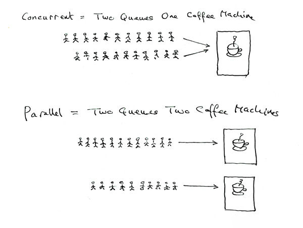

一个程序至少有一个进程, 一个进程至少一个线程, 一般情况下是多线程状态

互斥锁是指一个线程使用某一内存空间时会获得的一把“锁”，它会使用锁将这个内存空间锁起来，其他线程只有等当前线程使用完毕并将锁释放，才能使用该内存空间中的资源。任何线程获得释放后的锁，就有了使用权利，其他线程依旧要排队等待。

信号量用来指定某一内存空间通常可以被多少个线程使用。例如，当信号量为4时，内存空间中最多能同时存在4个线程，某个线程操作完内存空间中的资源后，信号量会自增1，从而允许其他线程进入该内存空间。

###### 同步vs异步

同步==有序执行, 不是同时执行

异步==独立执行, 互相之间不需要通信等待

##### 并发 vs 并行

并发, 程序交替执行

并行, 程序同一时刻运行

### threading库

python有3种使用线程的方式: thread, threading, ThreadPoolExecutor

- thread,   已被废弃更名为_thread
- threading  基于_thread, 比较常用
- ThreadPoolExecutor 在threading基础上进一步封装, 使用简单, 但是无法对线程进行精细控制

Threading 有两种方式创建线程

- 方法1: 创建 threading.Thread 实例, 将需要被线程执行的函数传入该实例
- 方法2: 创建一个类, 继承于 threading.Thread, 重写其 run() 方法
- 

