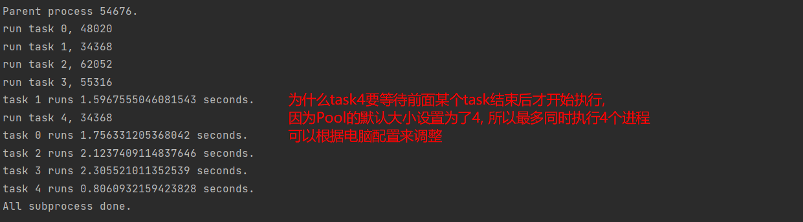

## multiprocessing 库

### 使用方式1: 直接调用 multiprocessing.Process 对象

具体的使用方式类似于 threading.Thread

```python
import multiprocessing
import time

def func(name):
    time.sleep(5)
    print('test process:', name)

if __name__ == '__main__':
    pl = []
    for i in range(5):
        name = f'python_process_{i}'
        p = multiprocessing.Process(target=func, args=[name])
        p.start()
        pl.append(p)

    for p in pl:
        p.join()

    print('main process finish!')
```

PS: **真正的并行操作, 多个CPU同时执行任务**

- 进程是 python 中最小的资源分配单元, 互相之间不能共享内存和数据
- 启动一个进程, 都要独立分配资源和拷贝访问的数据, 因此, **进程的启动/销毁**


## 使用方式2: 继承Process类

```python
import random, time, multiprocessing


class MyProcess(multiprocessing.Process):

    def __init__(self, name, func):
        super().__init__()
        self.name = name
        self.func = func

    def run(self):
        self.func(self.name)


def worker(name):
    print(f'started worker {name}')
    worker_time = random.choice(range(1, 5))
    time.sleep(worker_time)
    print(f'{name} worker finished in {worker_time} seconds')


if __name__ == '__main__':
    processes = []
    for i in range(5):
        process = MyProcess(name=f'computer_{i}', func=worker)
        processes.append(process)
        process.start()

    for process in processes:
        process.join()

```


# 进程池

适用于要启动大量子进程的情况, 批量创建子进程

```python
import os, time, random, multiprocessing


def long_time_task(name):
    print(f'run task {name}, {os.getpid()}')
    start = time.time()
    time.sleep(random.random() * 3)
    end = time.time()
    print(f'task {name} runs {end - start} seconds.')


if __name__ == '__main__':
    print('Parent process %s.' % os.getpid())
    pool = multiprocessing.Pool(4)  # 四进程的进程池  只能同时执行4个进程
    for i in range(5):
        pool.apply_async(long_time_task, args=[i])
    pool.close()  # 关闭进程池入口, 即不能再添加新的进程
    pool.join()
    print('All subprocess done.')

```

在 main 部分, pool 调用了 join(), 这样会等待所有子进程执行完毕, **调用 join() 之前必须先调用 close() **, 之后就不能添加新的进程进入进程池了.


# 进程锁

## 普通锁 Lock

multiprocessing.Lock   有 acquire() 和 release() 两个方法    也可以通过with上下文管理器

```python
import os, time, random
from multiprocessing import Lock, Process


def f(lock, i):
    # try:
    #     lock.acquire()
    #     print(f'{i}:{os.getpid()} is running')
    #     time.sleep(random.randint(1, 3))
    #     print(f'{i}:{os.getpid()} is done!')
    # finally:
    #     lock.release()

    with lock:
        print(f'{i}:{os.getpid()} is running')
        time.sleep(random.randint(1, 3))
        print(f'{i}:{os.getpid()} is done!')

if __name__ == '__main__':
    lock = Lock()
    for num in range(10):
        Process(target=f, args=(lock, num)).start()

```


## 可重入锁 RLock

```python
import os
import time
import random
from multiprocessing import Process, RLock

def f(lock, i):
    try:
        lock.acquire()
        lock.acquire()
        print(f'{i}:{os.getpid()} is running')
        time.sleep(random.randint(1,3))
        print(f'{i}:{os.getpid()} is done')
    finally:
        lock.release()
        lock.release()
		#锁几次就得release几次

if __name__ == '__main__':
    lock = RLock() # 可重入锁

    for num in range(10):
        Process(target=f, args=(lock, num)).start()
```


## 进程间通信

## Queue Pipes

